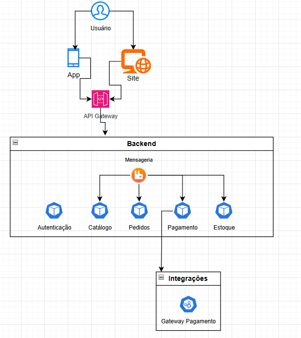
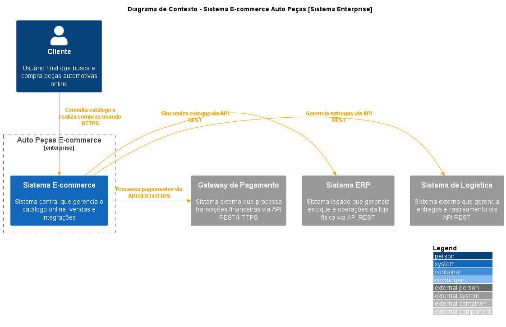
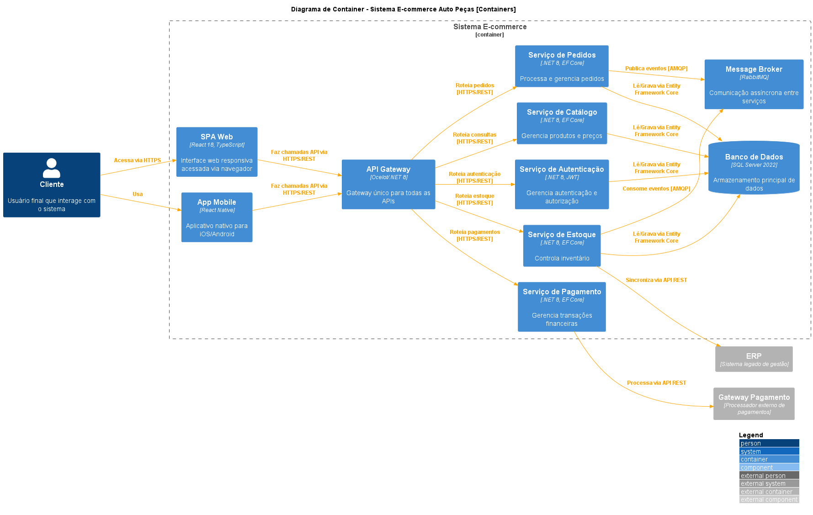
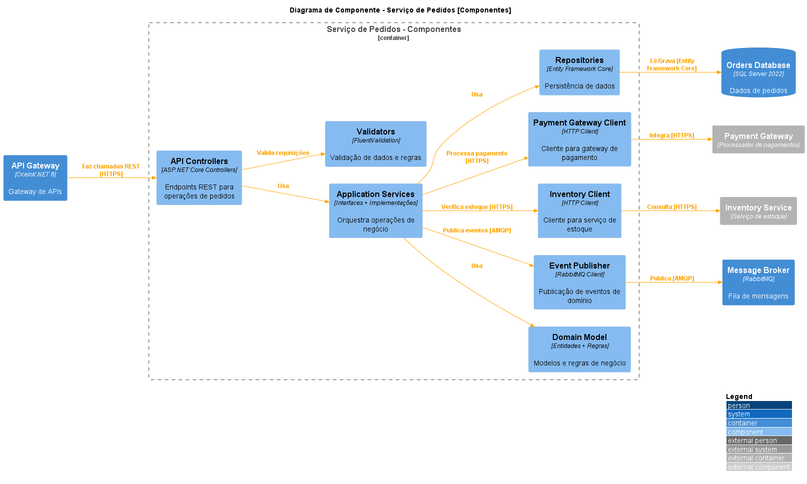

# README - Projeto de Arquitetura: Transformação Digital da Auto Peças X

## 📖 Storytelling

A **Auto Peças X**, uma loja tradicional com 10 anos de mercado, enfrenta desafios crescentes com a digitalização acelerada do varejo. O proprietário percebeu que seus clientes buscam cada vez mais soluções online. A loja, conhecida pelo atendimento personalizado e conhecimento técnico, vê suas vendas diminuírem enquanto concorrentes com presença digital ganham mercado. A transformação digital através de um **e-commerce** não é apenas uma oportunidade, mas uma **necessidade** para a sobrevivência do negócio.

---

## 🎯 O que esperamos aprender com esse projeto?

- Compreensão do comportamento do consumidor online de autopeças.
- Viabilidade técnica e financeira do projeto.
- Melhores práticas de integração entre loja física e digital.

---

## ❓ Perguntas que precisamos responder

- Como manter o diferencial do atendimento personalizado no ambiente digital?
- Como integrar o estoque físico com o virtual?
- Como gerenciar devoluções e trocas?

---

## ⚠️ Principais riscos

- Complexidade na integração de sistemas.
- Problemas de logística.
- Resistência dos funcionários à mudança.
- Erros na identificação de peças.

---

## 📝 Plano para responder às perguntas

1. **Realizar pesquisa de mercado** com clientes atuais.
2. **Benchmarking** com concorrentes.
3. **PoC (Prova de Conceito)** do sistema de integração.
4. **Treinamento da equipe**.

---

## 📉 Plano para reduzir riscos

1. Implementação **gradual** do e-commerce.
2. Manter **operação híbrida**.
3. **Treinamento intensivo** da equipe.
4. **Política clara de devoluções**.

---

## 🔄 Partes Interessadas e Expectativas

| **Parte Interessada**    | **Expectativa**                        |
| ------------------------ | -------------------------------------- |
| **Proprietário**         | Aumento do faturamento e modernização. |
| **Funcionários**         | Desenvolvimento de novas habilidades.  |
| **Clientes**             | Conveniência e maior disponibilidade.  |
| **Parceiros logísticos** | Novos fluxos de negócio.               |

---

## 👤 Usuários e Objetivos

| **Usuário**         | **Objetivo**                                  |
| ------------------- | --------------------------------------------- |
| Consumidores finais | Encontrar peças corretas rapidamente.         |
| Oficinas mecânicas  | Comparar preços e verificar disponibilidade.  |
| Frotistas           | Realizar compras com segurança.               |
| Vendedores internos | Acompanhar pedidos e atender clientes.        |
| Administradores     | Gerenciar operações e integração de sistemas. |

---

## 🚨 O pior que pode acontecer?

- **Indisponibilidade do sistema**.
- **Falha na integração dos sistemas**.
- **Erros na identificação de peças**.

---

## 🏗️ Arquitetura Inicial (Modelo Freeform)

- **Versão Inicial** 

### Componentes da Arquitetura:

1. **WebApp ou WebSite**: Interface com usuário responsiva.
2. **API Gateway**: Gerenciamento de requisições.
3. **Autenticação**: Segurança e controle de acesso.
4. **Catálogo**: Gestão de produtos e preços.
5. **Pedidos**: Processamento de vendas.
6. **Pagamento**: Integração com gateways.
7. **Estoque**: Controle de inventário.

---

## 🏗️ Requisitos Importantes

1. **Escalabilidade alta**: Suporte ao crescimento do negócio e picos de acesso.
2. **Resiliência**: Garantia de operação contínua.
3. **Tempo de resposta < 500ms**: Experiência fluida para clientes.
4. **Segurança**: Proteção de dados sensíveis e prevenção de fraudes.
5. **Interface intuitiva**: Facilidade na busca e identificação de peças.

---

## 🧐 O que o diagrama nos ajuda a pensar?

- **Fluxo de dados**.
- **Pontos de integração**.
- **Requisitos de segurança**.
- **Escalabilidade**.
- **Dependências entre sistemas**.

---

## 📌 Padrões Arquiteturais

- **Padrões essenciais:** Microsserviços, SAGA.
- **Padrões ocultos:** Monitoramento.

---

## 📜 Metamodelo

- **Freeform**.
- **Pode ser discernido no diagrama único?** Sim.
- **O diagrama está completo?** Não, poderia incluir mais detalhes sobre dados.
- **Poderia ser simplificado e ainda assim ser eficaz?** Não, pois já segue um padrão otimizado.

---

## 💬 Discussões Importantes da Equipe

### 📌 Ponto de decisão

- **Padrões de comunicação** entre serviços para manter desacoplamento e performance.
- **Dificuldade na escolha do serviço de mensageria**.
- **Nenhuma decisão sem retorno que tenha forçado desistência de uma escolha**.

---

## 📌 Arquiteturas em Camadas do C4

- **Nível Contexto** 
- **Nível Container** 
- **Nível Componente** 

---
